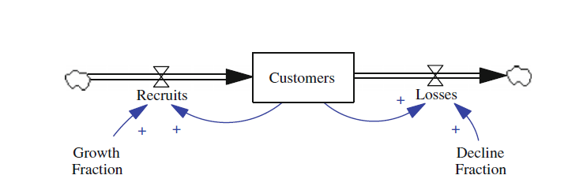
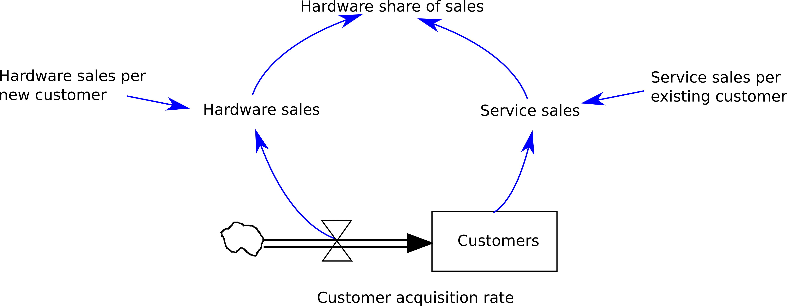

# Introduction
This tutorial is intended to introduce system dynamics modeling concepts and techniques using the R programming language. 

## Packages
The following packages are used throughout the tutorial. 

The `deSolve` package is primarily used to calculate the differential equations and numerical integration. 
For data analysis and plotting we use the `tidyverse` packages.

```{r}
library(deSolve) #supports numerical integration using a range of numerical methods
library(tidyverse) #supports visualization of layered graphics

```

## Models
A system dynamics model contains causal loops that identify the feedback of interactions between elements of a system. 
These causal loops are usually converted to ‘stocks’ and ‘flows’. 

**Stocks** represent elements with capacities that change over time. 
**Flows** define the rate at which a stock can change.

**Stock and flow diagrams** display the interactions between elements in the system so information can be traced throughout. 
*Linear and/or continuous equations in time* are applied to the system flows before initializing the system with appropriate stock levels based on expert input, previous research, or analyses (Duggan 2016).

## Stocks & Flows
A stock is the foundation of any system [@Meadows2008], and stocks and flows are the building blocks of system dynamics models. 
They characterize the state of the system under study, as well as providing the information upon which decisions and actions are based (Sterman 2000). 
Stocks can only change through their flows, which are the quantities added to (inflow), or subtracted from (outflow), a stock over time (Duggan 2016)




# deSolve Package (Customer Model, Chapter 2 Duggan 2016)

R’s `deSolve` package solves initial value problems written as ordinary differential equations (ODE), differential algebraic equations (DAE), and partial differential equations (PDE) [@soetaert2010]. 

For system dynamics models, the ODE solver in `deSolve` is used. The key requirement is that system dynamics modelers implement the model equations in a function, and this function is called by `deSolve` (Duggan 2016).
First, we initialize the simulation time constants and create simulation time vector using `seq()` :

```{r}
# Set time period and step
START <- 2015
FINISH <- 2050
STEP <- 1

simtime <- seq(START, FINISH, by = STEP)
```

The model vectors include `stocks` and its initial value and `auxs`, which are the exogeneous parameters.

```{r}
# Set stock capacity, growth and decline rates
stocks <- c(sCustomers = 10000)
auxs <- c(aGrowthFraction = 0.08, 
          aDeclineFraction = 0.03)

```

A **function** is created to execute the equations for simulation time, current stock vector, and model parameters. 
These are stored with `as.list()` for access. 
These are flows for recruits and losses along with net flow, a derivative. 


```{r}
# Create the function and returns a list
model <- function(time, stocks, auxs){
  with(as.list(c(stocks, auxs)), {
    fRecruits <- sCustomers * aGrowthFraction
    fLosses <- sCustomers * aDeclineFraction
    dC_dt <- fRecruits - fLosses
    return (list(c(dC_dt),
                 Recruits = fRecruits, 
                 Losses = fLosses,
                 GF = aGrowthFraction, 
                 DF = aDeclineFraction))
  }) 
}

```

The data frame ‘o’ is defined to allow the `deSolve` package function `ode` to solve the previous equations. 
The resulting outputs include summary statistics for visualizations.

```{r}
# Create the data frame using the `ode` function
o <- data.frame(ode(y = stocks, times = simtime, func = model,
                    parms = auxs, method = "euler"), method = "euler")

```


In the graph below the number of customers are a result of the differential equation of recruits and losses defined in the function model above.

```{r}
# Plot the output
o %>% 
  ggplot() +
  geom_line(aes(x = time, y = sCustomers, col = method)) +
  geom_point(aes(x = time, y = sCustomers, col = method)) +
  scale_y_continuous() +
  ylab("Customers") +
  xlab("Year") +
  ggtitle("Customers Over Time", subtitle = "2015 - 2030")

```
Tip: to keep track of your models, put all the model specific code in a separate R file that you source before calling `ode()` to simulate the model.

```{r}
source("models/customer.R")

# Create the data frame using the `ode` function
o <- data.frame(ode(y = stocks, times = simtime, func = model,
                    parms = auxs, method = "euler"), method = "euler")

head(o)
```


# Exercises

## Ex 1. Calculus 

The net flow for a population is given $\frac{dP}{dt} = rP$, where $r$ is the fractional
growth rate. From this, show that the integral is given by $P_t = P_0 e^{rt}$ where
$P_0$ is the initial value of the population.


## Ex 2. SD model of a University

Create a two stock system for a University. 

* One stock models students, 
* the other staff. 

Identify inflows and outflows for each stock. Add an additional
variable to the model called **student staff ratio**. Higher values of this ratio
make the University less attractive for students, and also result in the Univer-
sity hiring more staff. Show any feedback loops, and calculate the loop polari-
ties using two methods.

Draw the model using the symbols in the introductory chapter.

Tip: You can use a vector graphics program such as **Inkscape** to draw up the model.
Inkscape is a powerful, free design tool available at https://inkscape.org/
Inkscape drawings are stored as SVG files.
A SVG file containing templates of the required SD model components is available in this repository (sd_symbols_template.svg)
Use CTRL+D in Inkscape to make a copy of a template component to use in your model drawing.

## Ex 3. Numerical integration

Consider the net flow $\frac{dy}{dt} = 4t$. Assuming the stock $y$ is initially zero,
solve analytically for the value of $y$ after 10 time units. 

In addition, make a model called "growth" that can be integrated using `ode()` with DT = 0.5.
Use `method = "Euler"`  to solve for y. 
Use `method = "rk4"` as well. 

Plot all three curves (analytic, euler and RK4) using ggplot.
What do you observe?


Now decrease the step size to 0.05 and plot all three curves again.
What do you observe?

## Ex 4. Reproduce Vensim model in R

Use the code examples above to reproduce (simulate) the Hardware Share of Sales model from Vensim in R.
The details of this model (equations, values of constants) are contained in this Vensim tutorial video.

https://vensim.com/building-a-simple-vensim-model/

(The final SD model diagram is shown below, this was created using the Inkscape SVG component templates mentioned above.)

Plot the simulation output of the hardware share of sales as a function of time.




# References

Meadows 2008. Thinking in Systems, a primer.

Duggan, Jim. 2016. System Dynamics Modeling with R: Lecture Notes in Social Networks.

