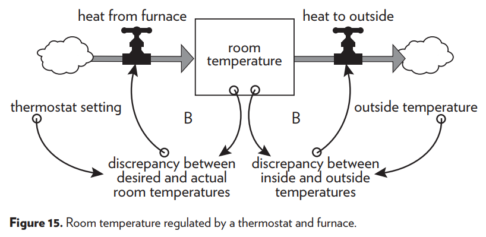
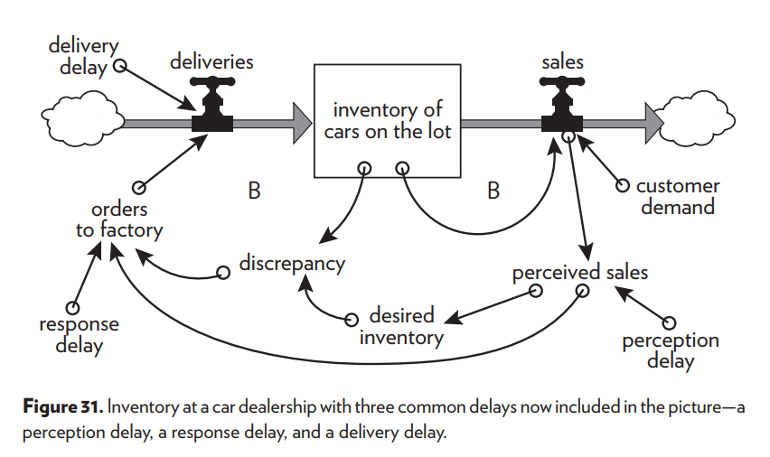

# Introduction
This tutorial is intended to introduce system dynamics modeling concepts and techniques using the R programming language. It contains examples and exercises.

## Packages
The following packages are used throughout the tutorial. 

The `deSolve` package is primarily used to calculate the differential equations and numerical integration. 
For data analysis and plotting we use the `tidyverse` packages.

```{r}
library(deSolve) #supports numerical integration using a range of numerical methods
library(tidyverse) #supports visualization of layered graphics

```

## Example: The bathtub

To refresh our SD modeling skills, we start easy and show how to implement the first model from [@Meadows08], the bathtub.
It consists of one stock, one inflow, and one outflow.

To keep track of our models, we put all the model specific code in a separate R file `bathtub.R` in the `models` folder, that we source before calling `ode()` to simulate the model.


```{r}
source("models/bathtub.R")

# Create the data frame using the `ode` function
o <- data.frame(ode(y = stocks, times = simtime, func = model,
                    parms = auxs, method = "euler"), method = "euler")

head(o)
```

```{r}
ggplot(o, aes(x = time, y = water_in_tub)) +
  geom_point() +
  geom_line() +
  expand_limits(y = 0) +
  ggtitle("Bathtub example from Meadows") +
  labs(x = "Minutes", y = "Gallons")
```


## Exercise 1: Thermostat

Chapter 2 of [@Meadows08], "A brief visit to the Systems Zoo",  contains various example SD models to demonstrate various aspects of SD modelling.
The appendix contains details on all models showcased in the book, allowing us  to try and reproduce the results.

As an exercise, you are going to implement the Thermostat model from Chapter 2 and reproduce Figures 16-20 from the book. The causal loop diagram is shown below.



You can use any tool you like (e.g. deSolve, Vensim, PySD or your own custom package written in C++ ;-).

If you use `deSolve`, you can use the R function `get_outside_temperature()`, provided below that returns the outside temperature for any given timepoint.

```{r}
source("models/get_outside_temperature.R")

time <- seq(0, 100, by = 0.25)

df <- data.frame(time, 
                 temp = get_outside_temperature(time))

ggplot(df, aes(x = time, y = temp)) +
  geom_point()
```


Answ: 

```{r}
# your answer here
```


## Example: Business Inventory: a system with delays

Later on in chapter 2, a thermostat-like system is described, introducing a new modeling element: delays.

Here we aim at reproducing the figures that demonstrate the dynamic behavior of the model shown on p51.



The model contains three delays:

* A Perception delay: car dealer averages sales over the last `aPerception_delay` days (moving average with a window)
* A response delay: only a `1/aResponse_delay` fraction of the `discrepancy` is transformed into `order to factory`
* A delivery delay: it takes `aDelivery_delay` days for orders to arrive at the car dealer


We start without delays. We set the perceptation delay to zero, and the delivery delay as well. If the response delay is zero, we divide by zero, so we set it to one instead. This means that the full discrepancy is directly ordered, and there is no response delay.

```{r}
source("models/business_inventory.R")

# Figure 30
auxs <- c(aPerception_delay = 0, # days
          aResponse_delay = 1,
          aDelivery_delay = 0)

# Create the data frame using the `ode` function
o <- data.frame(ode(y = stocks, times = simtime, func = model,
                    parms = auxs, method = "euler"), method = "euler")


ggplot(o, aes(x = time, y = sInventory_of_cars_on_the_lot)) +
  geom_point() +
  geom_line() +
  expand_limits(y = c(0, 500)) +
  ggtitle("Business Inventory example from Meadows") +
  labs(x = "Days", y = "Cars on the lot")
```

```{r}
source("models/business_inventory.R")
# Figure 32
auxs <- c(aPerception_delay = 5, # days
          aResponse_delay = 3, 
          aDelivery_delay = 5)

# Create the data frame using the `ode` function
o <- data.frame(ode(y = stocks, times = simtime, func = model,
                    parms = auxs, method = "euler"), method = "euler")

ggplot(o, aes(x = time, y = sInventory_of_cars_on_the_lot)) +
  geom_point() +
  geom_line() +
  expand_limits(y = c(0, 500)) +
  ggtitle("Business Inventory example from Meadows") +
  labs(x = "Days", y = "Cars on the lot")
```

In Figures 32 and 33 some key variables are plotted.
Figure 32 contains the sales per day, as well as the perceived sales per day.

```{r}
ggplot(o, aes(x = time, y = sales)) +
  geom_point() +
  geom_line() +
  geom_line(aes(y = perceived_sales), linetype = "dashed", col = "red") +  
  expand_limits(y = c(0, 60)) +
  ggtitle("Business Inventory example from Meadows") +
  labs(x = "Days", y = "Cars per day")
```
Figure 33 contains the orders and deliveries per day.

```{r}
ggplot(o, aes(x = time, y = orders_to_factory)) +
  geom_point() +
  geom_line() +
  geom_line(aes(y = deliveries), linetype = "dashed", col = "red") +  
  expand_limits(y = c(0, 60)) +
  ggtitle("Business Inventory example from Meadows") +
  labs(x = "Days", y = "Cars per day")
```

The manager decides to decrease the time over which she averages sales (the PerceptionDelay).
This has little effect. 

```{r}
source("models/business_inventory.R")
# Figure 34
auxs <- c(aPerception_delay = 2, # days
          aResponse_delay = 3,
          aDelivery_delay = 5)

# Create the data frame using the `ode` function
o <- data.frame(ode(y = stocks, times = simtime, func = model,
                    parms = auxs, method = "euler"), method = "euler")

ggplot(o, aes(x = time, y = sInventory_of_cars_on_the_lot)) +
  geom_point() +
  geom_line() +
  expand_limits(y = c(0, 500)) +
  ggtitle("Business Inventory example from Meadows") +
  labs(x = "Days", y = "Cars on the lot")
```
The manager then decides to reduces the response delay, making up perceived shortfalls in 2 instead of 3 days.
This makes things worse, as the overreaction increases.


```{r}
source("models/business_inventory.R")
# Figure 35
auxs <- c(aPerception_delay = 5, # days 
          aResponse_delay = 2,
          aDelivery_delay = 5)

# Create the data frame using the `ode` function
o <- data.frame(ode(y = stocks, times = simtime, func = model,
                    parms = auxs, method = "euler"), method = "euler")

ggplot(o, aes(x = time, y = sInventory_of_cars_on_the_lot)) +
  geom_point() +
  geom_line() +
  expand_limits(y = c(0, 500)) +
  ggtitle("Business Inventory example from Meadows") +
  labs(x = "Days", y = "Cars on the lot")


```

She should react LESS rapidly, for example by increasing the response delay from 3 to 6 days. Now the oscillations are damped out.

```{r}
source("models/business_inventory.R")
# Figure 36
auxs <- c(aPerception_delay = 5, # days
          aResponse_delay = 6,
          aDelivery_delay = 5)

# Create the data frame using the `ode` function
o <- data.frame(ode(y = stocks, times = simtime, func = model,
                    parms = auxs, method = "euler"), method = "euler")

ggplot(o, aes(x = time, y = sInventory_of_cars_on_the_lot)) +
  geom_point() +
  geom_line() +
  expand_limits(y = c(0, 500)) +
  ggtitle("Business Inventory example from Meadows") +
  labs(x = "Days", y = "Cars on the lot")
```

You can use the above code as an example how to implement SD delays in deSolve.

## Exercise 2: Create your own SD model with at least one delay

Create your own SD model, it should contain at least one stock, two flows and one delay.

For example a hospital where patients have an average length of stay. Introduce a shock in the flow, i.e. an increase of 10% in the inflow of patients. Simulate what happens to the outflow.

Or: Expand the SD model of coffee drinking from Meadows to include a delay. This models the fact that drinking coffee takes some time to sort effect, for example, only half an hour after drinking coffee the effects kick in.

Answ:

```{r}
# your answer here
```


# References

Meadows 2008. Thinking in Systems, a primer.

Duggan, Jim. 2016. System Dynamics Modeling with R: Lecture Notes in Social Networks.

