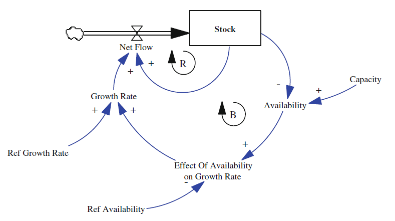
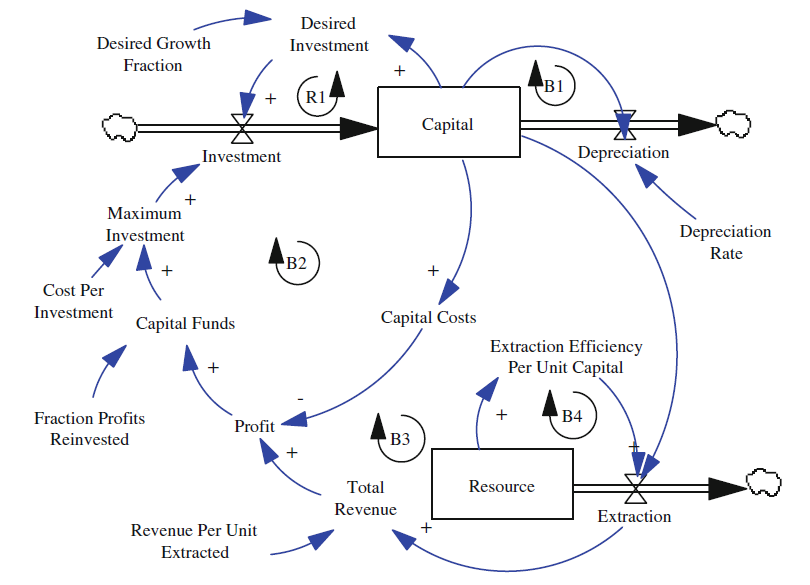

```{r}
library(tidyverse)
library(deSolve)
```


# Limits to Growth (Chapter 3 Duggan 2016)

Chapter available on researchgate:

https://www.researchgate.net/profile/Jim-Duggan/publication/303973122_Modeling_Limits_to_Growth/links/5d88b6e492851ceb7932b583/Modeling-Limits-to-Growth.pdf


# S-Shaped Growth

Starting point is the customer growth model, A one stock one flow model.

To this, a limiting factor (Capacity) is added as a balancing loop to counter growth as in the model below.

### Define model



*A one-stock model of limits to growth*


where stock has one inflow with an initial value of 100

$Stock= \int{}_{100}^{n} NetFlow$


and inflow of

$NetFlow=Stock∗GrowthRate$


with system capacity ratio of availability

$Availability = 1 − Stock / Capacity$


and a capacity of 10000 (arbitrary) to limit growth when stock equals capacity since availability will be zero

$Capacity=10,000$

### Simlin GUI and XMILE export

I created this model online in Simlin:
https://app.simlin.com/gsverhoeven/one_stock_constrained_capacity

This exports XMILE files (with Stella filename extension)

```{r}
library("readsdr")
```

```{r}
deSolve_components <- xmile_to_deSolve("models/one_stock_constrained_capacity.stmx") 

simtime <- seq(deSolve_components$sim_params$start,
               deSolve_components$sim_params$stop,
               deSolve_components$sim_params$dt)

output_deSolve <- ode(y      = deSolve_components$stocks,
                      times  = simtime,
                      func   = deSolve_components$func,
                      parms  = deSolve_components$consts, 
                      method = "euler")

result_df <- data.frame(output_deSolve)

head(result_df)
```
```{r}
library(patchwork)

stockTimePlot <- result_df %>% 
  ggplot() +
  geom_line(aes(time, sStock), color = "purple")

availTimePlot <- result_df %>% 
  ggplot() +
  geom_line(aes(time, availability), color = "blue")

netflowTimePlot <- result_df %>% 
  ggplot() +
  geom_line(aes(time, net_flow), color = "red")

growthrateTimePlot <- result_df %>% 
  ggplot() +
  geom_line(aes(time, growth_rate), color = "green")

(stockTimePlot + availTimePlot) / (netflowTimePlot + growthrateTimePlot)

```

As an alternative, we can also code the model directly using `deSolve`. 

### solving the model using deSolve

Using the R libraries, declare stock and auxiliary variables for the simulation including time period and step.

The model’s equations are contained within a function called by `deSolve` each timestep and passes a vector of stocks with sim values and a vector of auxiliaries. 
These values are evaluated from the equations (above). The variable `dS_dt` is an integral. The data frame `sModel` is created and the first few lines are displayed.

```{r}
source("models/one_stock_constrained_capacity.R")

```

```{r}
###########################################
# Define the stocks and auxiliaries.
stocks <- c(sStock = 100)
auxs <- c(aCapacity = 10000, 
          aRef.Availability = 1,
          aRef.GrowthRate = 0.10)

# Create the data frame
sModel <- data.frame(ode(y = stocks, times = simtime, func = model,
                    parms = auxs, method = "euler"))

```

```{r}
head(sModel)
```

### Visualize the Variables

The data frame `sModel` is plotted using `ggplot2`. We use the R package `patchwork` to combine multiple ggplots in one figure.

We display the following relationships:

* In the **Stock versus Time plot**, the classic growth mode is exhibited by an exponential growth to time period 46 followed by a logarithmic growth to 100. 
* The **Availability plot** mirrors the Stock plot since the resource diminishes as stock increases. 
* The **Growth Rate** is driven by the effect function

$Effect\_of\_Availability\_on\_Growth\_Rate = f(Availability / Ref\_Availability),$
$GrowthRate = Ref\_GrowthRate∗Effect\_of\_Availability\_on\_GrowthRate$

and follows Availability until it reaches its capacity.

* Finally, **Net Flow** drives the Stock value by rising and falling exponentially with the rate of change.

```{r}
library(patchwork)

stockTimePlot <- sModel %>% 
  ggplot() +
  geom_line(aes(time, sStock), color = "purple")

availTimePlot <- sModel %>% 
  ggplot() +
  geom_line(aes(time, Availability), color = "blue")

netflowTimePlot <- sModel %>% 
  ggplot() +
  geom_line(aes(time, NetFlow), color = "red")

growthrateTimePlot <- sModel %>% 
  ggplot() +
  geom_line(aes(time, GrowthRate), color = "green")

(stockTimePlot + availTimePlot) / (netflowTimePlot + growthrateTimePlot)

```


The above model is related to the differential equation formulated by Belgian mathematician Verhulst in 1845 (below) to model population increase with growth rate $r$ and limit $K$:


$\frac{dP}{dt}=rP∗(1−PK)$


This model assumes the capacity to be constant, which is problematic because the stock is consumed over time in most realistic models (Duggan 2016).

### Exercise

What happens when the growth rate is increased to 25%? Make the same four plots as above.


Answ: 

```{r}
# your answer here
```

# Modeling Constraints: A Non-renewable Stock (Chapter 3 Duggan)

Many systems modeled with system dynamics methods involve **non-renewable stocks**, which are stocks that when depleted cause another stock’s value to decline. 
The model below depicts how oil well growth, **capital**, is dependent on the availability of oil, the **resource**. 
As capital grows so does the amount of oil extracted. This process has several loops.


*Limits to growth for capital, constrained by a non-renewable resource*


There are five loops in the oil well model, of varying types. 

* The **positive feedback loop R1** is driven by a desired investment in the capital, the oil wells, whose growth is determined by the growth fraction. 
Growth is measured by the number of oil wells; more wells equates to more extraction, capital, investment, and profit. 

The **negative feedback loop, B1**, accounts for the capital depreciation rate. Over time oil well equipment will need repairs or replacement thus driving depreciation. 

In **the negative feedback loop B2**, oil well equipment purchase (startup) costs are driven by the total revenue, amount of reinvestments, profit, and capital costs. More capital results in more oil extraction. However, more investments in capital reduces profits and lower available investments. 

Finally, the **negative feedback loops B3 and B4** describe the non-renewable resource (oil). As extraction increases with capital, the resource eventually decreases along with extraction efficiency and rate. 
Efficiency is reduced due to the lack of natural pressure pushing the oil to the surface.

### model details

The capital stock has an initial value of 5 and integrates the difference of investments and depreciation (constant 5%).

$Capital=\int_{5}^{n}(Investments - Depreciation)$

$Depreciation=Capital \times DepreciationRate$

$DepreciationRate=0.05$


The amount of desired investment is the product of growth fraction and capital.

$Desired\ Investment = Desired\ Growth\ Fraction \times Capital$

$Desired\ Growth\ Fraction=0.07$


Growth is limited by the resource since efficiency decreases, which is defined by **extraction rate** and is important to understanding feedback loops B3 and B4. 
The plot of resource by efficiency (below) displays this relationship.

$Resource= \int^{n}_{1000}(−Extraction)$

$Extraction=Capital\ Extraction\times Efficiency\ Per\ Unit\ Capital$

With capital costs set at 10% of capital and revenue per unit extracted at 3, the total revenue can be determined and then deducted to attain the profit.

$Total\ Revenue = Revenue\ Per\ Unit\ Extracted \times Extraction$

$Revenue\ Per\ Unit\ Extracted=3$

$Capital\ Costs=Capital\times0.10$

$Profit=Total\ Revenue−Capital\ Costs$


The maximum capital investment is calculated by allocating 12% of profits reinvested at a cost of 2 per investment.

$Fraction\ Profits\ Reinvested=0.12$

$Capital\ Funds = Profit\times Fraction\ Profits\ Reinvested$

$Cost\ Per\ Investment=2$

$Maximum\ Investment=Capital\ Funds / Cost\ Per\ Investment$


The **MIN()** function is applied as a practical verification for maximum possible investment value so as to not exceed a particular goal.

$Investment=MIN(Desired\ Investment,Maximum\ Investment)$


The model is initialized with a time period and step along with stocks and auxiliary values and rates.

```{r}
# Set the time period and step
START <- 0
FINISH <- 200
STEP <- 0.25

# Set the stocks and auxiliaries
simtime <- seq(START, FINISH, by = STEP)

stocks <- c(sCapital = 5, 
            sResource = 1000)

auxs <- c(aDesired.Growth = 0.07,
          aDepreciation = 0.05,
          aCost.Per.Investment = 2.00,
          aFraction.Reinvested = 0.12,
          aRevenue.Per.Unit = 3.00)
```

The `approxfun()` function interpolates input and output vectors (resource and extraction) in order to “linearize” the new function’s output, extraction efficiency per unit capital:


```{r}
source("code/func.Efficiency.R")

ggplot(data.frame(x = 0:1000, y = func.Efficiency(0:1000)), aes(x =x , y =y )) +
  geom_line() +
  labs(x = "resource" , y = "extraction efficiency per unit capital")

```

### Solve model using deSolve

Given the previous equations and functions, the model’s function is constructed and the `ode()` function called to create a data frame of the output.

```{r}
source("models/oil_well_model.R")

# Create the data frame to use for visualizations
nonNewModel <- data.frame(ode(y = stocks, times = simtime, func = model,
                    parms = auxs, method = "euler"))

```

### Visualize the variables

Inspecting the plot generated below depicting 

* extraction, 
* capital, 
* resources, and 
* depreciation 

shows the relationships of the stocks and flows. 

```{r}
# Plot the outputs
extraction <- nonNewModel %>% 
  ggplot() +
  geom_line(aes(time, Extraction), color = "orange") +
  ylab("Extraction Rate") +
  xlab("Year")

capital <- nonNewModel %>% 
  ggplot() +
  geom_line(aes(time, sCapital), color = "red") +
  ylab("Capital") +
  xlab("Year")

resources <- nonNewModel %>% 
  ggplot() +
  geom_line(aes(time, sResource), color = "purple") +
  ylab("Resource") +
  xlab("Year")

depreciation <- nonNewModel %>% 
  ggplot() +
  geom_line(aes(time, Depreciation), color = "green") +
  geom_line(aes(time, Investment), linetype = "dashed", linewidth = 0.75) +
  ylab("Depreciation or Investment") +
  xlab("Year")

(extraction + capital) / (resources + depreciation)

```

Exponential extraction rates precedes capital while reducing the resources, increasing investments (black dashed line) and capital depreciation. 

Ultimately the resource becomes too expensive to extract as does the capital overhead causing capital and profits to decline.

### Maximum Values of key stocks or rates

For this scenario, the years during which maximum capital and extraction rates occur are calculated.  For this we can use the `which.max()` R function.


```{r}
# Find the time (year) in which the maximum capital and extraction rate are realized
nonNewModel[which.max(nonNewModel$sCapital), "time"]
## [1] 87
nonNewModel[which.max(nonNewModel$Extraction), "time"]
## [1] 64.25

```

### Exercise

Increase the capital depreciation to 25% and plot the outputs. Explain the results.

Answ:

```{r}
# your answer here

```


# Creating Scenarios: Effect of Growth Rate on Results

System dynamics modeling often allows users to investigate multiple scenarios for consideration. 

Given the outputs of the model (above), the changes to capital, extraction rate, and investments becomes apparent. 
Typically, the more aggressive the growth rate the more rapid the extraction and subsequently the consumption of the resource.

```{r}
# Change the aDepreciation back to 0.05
auxs <- c(aDesired.Growth = 0.07,
          aDepreciation = 0.05,
          aCost.Per.Investment = 2.00,
          aFraction.Reinvested = 0.12,
          aRevenue.Per.Unit = 3.00)
```

Using the `rbind()` function to append data sets, a range of growth rates can be simulated. `scenarios()` is an R function to automate this process.
The function arguments include `stocks`, `simtime`, `model`, and `auxs`, all defined above.

```{r}
source("code/scenarios.R")

base <- scenarios(parameter_to_vary = "aDepreciation",
                  start_value = 0.05, n = 7,  step = 0.01,
                  stocks, simtime, model, auxs)
```

```{r}
# Plot the scenarios
base %>% 
  ggplot() +
  geom_line(aes(time, Extraction, color = factor(par_value))) +
  xlab("Year") +
  ylab("Extraction Rate") +
  theme(legend.position = "bottom") +
  guides(color = guide_legend(title = NULL)) +
  ggtitle("Growth Rate Scenarios")

```

It is important to acknowledge that this model is paramount in a variety of industries where growth has to be considered based on the available resources, whether that be oil, patients, or customers where several independent variables act upon a dependent variable. Given the oil well model instance described above, it is easy to imagine the complexity of a more realistic and pragmatic model with dozens of stocks and flows.

# Exercises

1. Build a set of equations to model **Experienced Programmer Productivity**, based on the following scenario. 

The appropriate effect equations can be sketched to show the overall impact as the variable is:
(1) at its reference value, 
(2) less than its reference value and 
(3) greater than its reference value.

Productivity is influenced by three variables: 

* Overtime, 
* Rookie Proportion, and 
* Average Time to Promotion. 

As these variables increase, productivity declines.

– The reference value for Experienced Programmer Productivity is 200 lines
of code (LOC)/Day.
– The reference value for overtime is 5 hours per week
– The reference rookie proportion is 20%
– The average time for promotion is 24 months.

```{r}
# your answer here
```


2. Based on the non-renewable stock model, and assuming a capital growth rate of 10%, run two additional scenarios whereby the resource is doubled and quadrupled. What impact does these additional scenarios have on the time of peak
extraction?

```{r}
# your answer here
```
