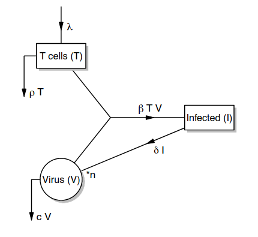
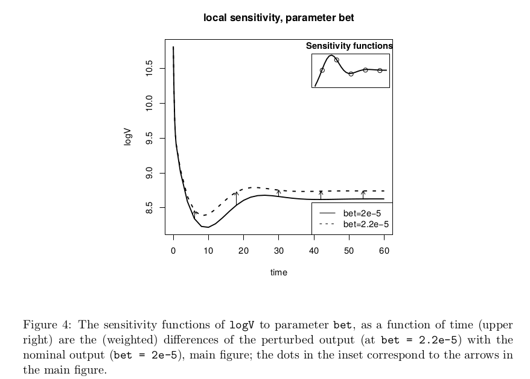

```{r setup, include=FALSE}
knitr::opts_chunk$set(echo = TRUE)
```

# Introduction

Mathematical simulation models are commonly applied to analyze experimental or environmental data and eventually to acquire predictive capabilities. Typically these models depend on poorly defined, unmeasurable parameters that need to be given a value. Fitting a model to data, so-called **inverse modelling**, is often the sole way of finding reasonable values for these parameters. 

There are many challenges involved in inverse model applications, e.g., 

* the existence of non-identifiable parameters, 
* the estimation of parameter uncertainties and 
* the quantification of the implications of these uncertainties on model predictions.

The R package **FME** is a modeling package designed to confront a mathematical model with data. A recent high impact application is in a geoscience Nature paper for sensitivity analysis. It implements part of the functions from a Fortran simulation environment FEMME (Soetaert, deClippele, and Herman 2002).

It includes algorithms for 
* sensitivity analysis (local and global), 
* parameter identifiability analysis, 
* model fitting and 
* provides a Markov-chain based method to estimate parameter confidence intervals. 

Although its main focus is on mathematical systems that consist of **differential equations**, FME can deal with other types of models. 

In this R notebook, the potential of FME for inverse modelling is demonstrated by means of a simple 3-compartment dynamic model from the biomedical sciences that describes the dynamics of the HIV virus, responsible for the acquired immunodeficiency syndrome (AIDS).

<!--(Vignette “FMEdyna” comprises a dynamic simulation example, similar as in the current paper, but putting more emphasis on sensitivity and Monte Carlo analysis, in lack of data.) -->

## Typical workflow for fitting a dynamic model to data

Parameter estimation (a.k.a. fitting the model) is done in several steps. 

* First, the parameters to which the model is sensitive are identified and selected. 
* Then an identifiability analysis allows to evaluate which set of model parameters can be estimated based on available observations. 
* After fitting these parameters to the data, their uncertainty given the data is assessed using an MCMC method. 
* Finally, the consequences of the uncertain parameters on the model outcomes is quantified and visualized.


## Load packages

```{r}
library("FME")
library(tidyverse)
```

# Demo HIV model

This is a simple 3-compartment dynamic model from the biomedical sciences that describes the dynamics of the HIV virus, responsible for the acquired immunodeficiency syndrome (AIDS). The example models the dynamics of the HIV virus in human blood cells (Figure 1).

Some terminology translations:
* Sources = inflow
* Sinks = outflow
* Compartment, component  = stock (Here: T cells, Infected Cells and Virus particles)



The model has six parameters.

In practical cases, the parameters from this model are estimated based on clinical data obtained from individual patients. As it is more costly to measure the number of infected cells $I$, (Xia 2003), this compartment is often not monitored. Here we assume that this is the case. So we have only data for the **number of T cells T** and **the number of virus particles V**.
The occurrence of unobserved variables is very common in mathematical models.

```{r}
###################################################
### The HIV model, as an R-function
###################################################
HIV_R <- function (pars, V_0 = 50000, dV_0 = -200750, T_0 = 100) {

  derivs <- function( time, y, pars) {
    with (as.list(c(pars,y)), {

      dT = lam - rho*T - bet*T*V # uninfected T cells, (+) parameters lam, (-) rho and bet
      dI = bet*T*V - delt*I # infected T cells, parameters (+) bet and (-) delt
      dV = n*delt*I - c*V - bet*T*V # virus, (+) parameters n, delt, (-) c, and bet

      return(list(c(dT, dI, dV), logV = log(V)))
    })
  }

  # initial conditions
  I_0   <- with(as.list(pars), (dV_0 + c*V_0) / (n*delt)) # derive this from  Virion data
  y     <- c(T = T_0,  I = I_0,  V = V_0)

  times <- c(seq(0, 0.8, 0.1), seq(2, 60, 2))
  
  out   <- ode(y=y,parms=pars,times=times,func=derivs)

  as.data.frame(out)
}
```


It takes about 20 times longer to run the pure-R version, compared to the compiled version.
As this will be significant when running the model multiple times, in what follows, the fast
version (HIV) will be used.

```{r}
###################################################
### The HIV model, as a DLL 
###################################################
HIV <- function (pars, V_0 = 50000, dV_0 = -200750, T_0 = 100) {

  I_0 <- with(as.list(pars),(dV_0 + c*V_0) / (n*delt))
  y <- c(T = T_0,  I = I_0,  V = V_0)

  times <- c(0, 0.1, 0.2, 0.4, 0.6, 0.8, seq(2, 60, by = 2))
  
  out <- ode(y = y, parms = pars, times = times, func = "derivshiv",
    initfunc = "inithiv", nout = 1, outnames = c("logV"), dllname = "FME")

  as.data.frame(out)
}
```

Two single runs of the model, both scripted and compiled (written in Fortran) version.

```{r}
library(patchwork)

pars = c(bet=0.00002, 
         rho=0.15, 
         delt=0.55, 
         c=5.5, 
         lam=80, 
         n=900)

outc <- HIV(pars=pars)
out <- HIV_R(pars=pars)
```

```{r}
p1 <- ggplot(out, aes(x = time, y = logV)) +
  geom_line() +
  geom_point(data = outc, col = "red") +
  labs(title = "Viral load", x = "time", y = "log(V)")

p2 <- ggplot(out, aes(x = time, y = T)) +
  geom_line() +
  geom_point(data = outc, col = "red") +
  labs(title = "CD4+ T cells", x = "time", y = "")

p1 + p2
  
```

## Exercise 1: explain the patterns you see here. What is going on here?

Answer:
[...]

# Synthetic data for model fitting

We use simulated data as real data to fit the model on.
Since we simulated the data ourselves, all the parameter values are known, so we can see if we can retrieve them using fitting routines.

The simulated data is simply the model data we simulated above, with noise added on, and measured only at specific points in time. 
The virions have been counted at high frequency, but with measurement error.
The T cells are recorded at lower frequency (4-days intervals), but with a higher precision.

```{r}
###################################################
### The pseudodata for log(viral count), T-cells
###################################################
set.seed(123)

sd_logV <- 0.45

sd_T <- 4.5*10

DataLogV  <- cbind(time = out$time,
                   logV = out$logV + rnorm(n = length(out$logV),
                                           sd = sd_logV),
                   sd = sd_logV)

# selection of measurement times
ii    <- which (out$time %in% seq(0, 56, by=4)) # every four days

DataT <- cbind(time = out$time[ii],
               T = out$T[ii] + rnorm(n = length(ii),
                                     sd = sd_T),
               sd = sd_T)

head(DataLogV)
head(DataT)
```

## Exercise 2: plot the data

Make two plots where you plot logV vs time and T vs time, including both the data generated by the model "out" and the synthetic "noisy measurements".

Answer:
```{r}
# your answer here
```


# Quantifying model fit

When we are fitting the model to the data, we need a cost function that estimates goodness of fit.

For this the FME package has the `FME::modCost()` function. This function calculates the *Discrepancy of a Model Solution with Observations*.

Since we have a multi-dimensional optimization problem, the following caveats need to be taken into account.

* Variables can have different units and magnitudes
* Variables can have different measurement error
* Variables can have different time resolution

The `FME::modCost()` function has options to handle these three situations using weighing.
It takes as arguments the output of a model run, the actual data, and an optional column that contains the measurement error.

It computes:

* the weighted residuals, one for each data point
* the variable costs, i.e. the sum of squared weight residuals per variable
* the model cost, the scaled sum of variable costs


Note that since we have two separate datasets, the function is called twice as a chain (i.e. the output of the first call is used as input to the second call).

<!-- modCost assumes the measurement errors to be normally distributed and independent. If there exist
correlations in the errors between the measurements, then modCost should not be used in the fitting or MCMC
application, but rather a function that takes in to account the data covariances. -->


```{r}
###################################################
### The "cost" function 
###################################################

HIVcost <- function (pars) {
  # do a single run with pars = pars
  out <- HIV(pars)
  cost <- modCost(model = out, 
                  obs = DataLogV, 
                  x = "time", 
                  err = "sd") # the name of the column with the error estimates, used to weigh the residuals
  
  return( modCost(model = out, 
                  obs = DataT,  
                  x = "time",  
                  err = "sd", 
                  cost = cost)) # if cost argument not NULL, the output of a previous call to modCost; in this case, the new output will combine both.
}

# model: one value, the model cost, which equals the sum of scaled variable costs
HIVcost(pars)$model

#head(HIVcost(pars)$residuals)

```

```{r}
HIVcost(pars)$var
```

# Exercise 3: explore effect of two parameters on model fit

a) Vary beta and rho +/- 10% around their optimal values, and plot the model cost in a two-dimensional plot, for example as a heatmap.
(Hint use a for loop within a for loop to vary both beta and rho around their true values)
(Hint you can use the `viridis` package to get a nice color map to visualize the gradient, e.g. `viridis::turbo()`)

Answer:

```{r}
# your answer here
```


b) Then, do the same for the parameters beta and c. What difference do you notice?

```{r}
# your answer here
```

# Local sensitivity analysis

Not all parameters can be finetuned on a certain data set. Some parameters have little effect
on the model outcome, while other parameters are so closely related that they cannot be
fitted simultaneously.

Function `FME::sensFun()` estimates the sensitivity of the model output to the parameter values in a set
of so-called sensitivity functions (Brun et al. 2001; Soetaert and Herman 2009). When applied
in conjunction with observed data, `sensFun` estimates, for each datapoint, the derivative of
the corresponding modeled value with respect to the selected parameters. A schema of what
these sensitivity functions represent can be found in Figure 4 (taken from the JSS paper).



```{r}
###################################################
### Sensitivity functions 
###################################################

Sfun <- sensFun(HIVcost, pars)
summary(Sfun)

```

L1 and L2 are scaled weighted mean sensitivities. `delt` is the least influential on the behavior of the model. The other five are more or less equally important (same order of magnitude).

```{r}
plot(Sfun %>% filter(var == "T"),  lwd=2)
```
```{r}
plot(Sfun %>% filter(var == "logV"))
plot(Sfun %>% filter(var == "T"), lwd = 2)
```

# Multivariate parameter identifiability

The above pairs analysis investigated the identifiability of sets of two parameters. Function `collin()` extends the analysis to all possible parameter combinations, by estimating the approximate linear dependence (“collinearity”) of parameter sets. A parameter set is said to be identifiable, if all parameters within the set can be uniquely estimated based on (perfect) measurements. Parameters that have large collinearity will not be identifiable.

If the index exceeds a certain value, typically chosen to be 10–15, then the parameter set is poorly identifiable (Brun et al. 2001) (any change in one parameter can be undone for 90 respectively 93%).
It turns out that the set of all 6 parameters is jointly highly collinear. So we cannot fit the full set of parameters to the data, we have to choose a subset.

```{r}
###################################################
### Model identifiability (collinearity)
###################################################

ident <- collin(Sfun)
ident %>% filter(collinearity < 15) %>% arrange(-N)

```

It turns out that there are two sets of five parameters that can be estimated from the data.
We'll pick the top row, leaving out `n`.
Note that this parameter set cannot be identified on either `logV` nor `T` data alone.

# Fitting the model to data

Now the big moment has finally arrived, we are ready to fit our five model parameters to our handfull of noisy data measurements!

This finds the global minimum using `FME::modFit()`.

To fit the HIV model to the data, a new function is needed that takes as input the logarithm of all parameter values except n (which is given a fixed value 900), and that returns the model cost.

The log transformation (1) ensures that the parameters remain positive during the fitting, and (2) deals with the fact that the parameter values are spread over six orders of magnitude (i.e., bet = 2e-5, lam = 80). Within the function HIVcost2, the parameters are backtransformed (exp(lpars)).

After perturbing the parameters, the model is fitted to the data, and best-fit parameters and residual sum of squares shown. Perturbation is done mainly for the purpose of making the application more challenging.

```{r}
###################################################
### Cost function with 5 parameters; log-transformed
HIVcost2 <- function(lpars)
    HIVcost(c(exp(lpars),n=900))

### Fit model to data
Pars <- (pars[1:5]) * 2 # perturb original pars (simply doubles them)
Fit  <- modFit(f=HIVcost2, p=log(Pars))

# note that these values are the log values of the actual parameters
summary(Fit)
```

```{r}
exp(coef(Fit))
deviance(Fit)
```

## Exercise 4: comparing fitted values to true values

Compare the fitted values of the parameters to their true values.
Did the fitting routine do a good job in finding the true parameters that generated the data?

Answer:

```{r}
# your answer here
```

## Exercise 5: effect of initial values
Play around with the initial parameter values. What happens if we perturb them more, or set them all at zero?
Does it still work? Note that the `Pars` needs to be a named vector of length 5.

```{r}
# your answer here
```


# MCMC to get the full set of plausible parameter values

To get proper uncertainty for the complete set of parameters, given a dynamic model that has no analytical solution, we can take a Bayesian approach. We assume weak or flat priors for all parameters, let the likelihood of a set of parameters (i.e. how likely is it to observe the data, given the model and the set of parameters) be proportional to the model cost function, and then we have a setup where we can use Bayesian methods to sample from the posterior.

Bayesian methods can be used to derive the data-dependent probability distribution of the parameters. Function `modMCMC()` implements a Markov Chain Monte Carlo (MCMC) method that uses the delayed rejection and adaptive Metropolis (DRAM) procedure (Haario et al. 2006; Laine 2008). 

An MCMC method samples from probability distributions by constructing a Markov chain that has the desired distribution as its equilibrium distribution. Thus, rather than one parameter set, one obtains an ensemble of parameter values that represent the parameter distribution. 

In the **adaptive Metropolis** method, the generation of new candidate parameter values is made more efficient by tuning the proposal distribution to the size and shape of the target distribution. This is realized by generating new parameters with a **proposal covariance matrix** that is estimated by the parameters generated thus far. During **delayed rejection**, new parameter values are tried upon rejection by scaling the proposal covariance matrix. This provides a systematic remedy when the adaptation process has a slow start (Haario et al. 2006).  

In the implementation in FME, it is assumed that the prior distribution for the parameters $\theta$ is either non-informative (flat priors)) or Gaussian. From the `modMCMC()` help: `prior` : in the latter case a non-informative prior is used (i.e. all parameters are equally likely, depending on lower and upper within min and max bounds).

Setting `ntrydr` equal to 1 (the default) toggles off delayed rejection.

## Sampling from a 3D normal distribution

To get a feel for what is going on, we first sample from a known probability distribution, a 3D multivariate Gaussian distribution with its peak density at x = 1, y = 2, z = 3 and a standard deviation of 0.1 in all directions.

```{r}
NN <- function(p) {
  mu <- c(1,2,3)
  -2*sum(log(dnorm(p, mean = mu, sd = 0.1)))   #-2*log(probability)
}

NN(p = c(0,0,3))
NN(p = c(1,2,3)) # most likely given the distribution
```

`modMCMC` implements the Metropolis-Hastings method. The proposal distribution, which is used to generate new parameter values is the (multidimensional) Gaussian density distribution, with standard deviation given by `jump`.
p sets the initial values for the parameters to be optimized over.

```{r}
set.seed(123)
# simple Metropolis-Hastings
MCMC <- modMCMC(f = NN, p = c(0,0,0), niter = 10000,
                outputlength = 10000, burninlength = 1000, jump = 0.5)

# samples
head(MCMC$pars)
```
## Exercise 6: working with samples from the posterior

Calculate the mean and standard deviation for the MCMC samples of p1, p2 and p3.
Compare these to the true values of the (in this case known) distribution of the three parameters.
Did the algorithm work?

Answer:
```{r}
# your answer here
```

We can plot the MCMC chains to check if there were problems during sampling:

```{r}
plot(MCMC)
```
Here the typical behavior of the metropolis algorithm is observed: if it is at a high density point, it tends to stay there, leading to autocorrelations in the sample and slow exploration of the neighbourhood.

```{r}
ggplot(data.frame(MCMC$pars), aes(x = p1, y = p2)) +
  geom_point(alpha = 0.01) 
```
We can see it can spend quite some time in one point before it hops to the next one.


```{r}
# More accepted values by updating the jump covariance matrix...
MCMC <- modMCMC(f = NN, p = c(0,0,0), niter = 20000, updatecov = 100,
                 outputlength = 10000, burninlength = 1000, jump = 0.5)
summary(MCMC)
```

```{r}
plot(MCMC)   # check convergence
```
```{r}
ggplot(data.frame(MCMC$pars), aes(x = p1, y = p2)) +
  geom_point(alpha = 0.1) 
```


## MCMC for the HIV model

The MCMC method is now applied to the example model. In order to prevent long burn-in, the algorithm is started with the optimal parameter set (Fit\$par) as returned from the fitting algorithm, while the prior error variance var0 is chosen to be the mean of the unweighted squared residuals from the model fit (Fit\$var_ms_unweighted); one for each observed variable (i.e., one for logV, one for T). The weight added to this prior is low (wvar0 = 0.1), such that this initial value is not so important. The proposal distribution (used to generate new parameters) is updated every 50 iterations (updatecov). The initial proposal covariance (jump) is based on the approximated covariance matrix, as returned by the summary method of modFit, and scaled appropriately (Gelman et al. 2004).

```{r}
set.seed(123)
Pars <- (pars[1:5]) # perturb original pars (simply doubles them)
Fit  <- modFit(f=HIVcost2, p=log(Pars))

###################################################
### Run MCMC
###################################################
var0 <- Fit$var_ms_unweighted
cov0 <- summary(Fit)$cov.scaled*2.4^2/5

# # this takes a while (a minute) ...
# MCMC <- modMCMC(f=HIVcost2, p=Fit$par, niter=10000, jump=cov0,
#                 var0=var0, wvar0=0.1, updatecov=50)

MCMC <- modMCMC(f=HIVcost2, p=log(pars[1:5]), niter=10000, jump=cov0,
                var0=var0, wvar0=0.1, updatecov=50)
```


```{r}
MCMC$pars <- exp(MCMC$pars)
summary(MCMC)
```
make traceplots, look like nice hairy caterpillars.

```{R}
plot(MCMC, Full = TRUE)
```
From the pair plots it becomes really clear that the $\beta$ and $c$ parameters indeed are highly collinear and can substitute for each other.

```{r}
pairs(MCMC, nsample = 1000)
```

# Model prediction (Posterior predictions)

Now that we have fitted the model to the data, and having obtained the full distribution of plausible parameter values given the model and the data, we can examine the consequences of all this uncertainty for the model predictions.
This is now very simple, as we can simply draw a set of parameters from the posterior distribution and run a simulation using those parameters. By repeating this a few hundred times we can draw a credible interval around the model predictions for the most plausible set of parameters.

This uses `FME::sensRange()`.

```{r}
sR <- sensRange(func = HIV, parms = pars, parInput = MCMC$par)
plot(summary(sR), xlab = "time")
```


# Can we also use Stan to fit the model to the data?

The package implements a particular sampling method called DRAM, but we actually expect that the Stan sampler would be superior here, as it is designed to very efficiently explore densities with a variety of shapes in higher dimensions (here 6 dimensions). However, we would need to switch completely to Stan's ODE solvers, and there would be problems if we start to include non smooth transitions, such as lookup tables, that cannot be differentiated. 
https://discourse.mc-stan.org/t/stan-can-calculate-system-dynamics-models/16901/4
But however, here is a fitted SIR model in Stan:
https://jrmihalj.github.io/estimating-transmission-by-fitting-mechanistic-models-in-Stan/
In fact: Jair and Jim did exactly this!
https://onlinelibrary.wiley.com/doi/full/10.1002/sdr.1693
A Bayesian approach to calibrate system dynamics models using Hamiltonian Monte Carlo


# References

* R Package FME : Inverse Modelling, Sensitivity,
Monte Carlo – Applied to a Dynamic Simulation
Model https://www.rforscience.com/files/mate/downloads/fme/FMEdyna.pdf

* JSS paper: Inverse Modelling, Sensitivity and Monte Carlo
Analysis in R Using Package FME https://tbb.bio.uu.nl/rdb/practicals/deuterium/Soetaert_jss10.pdf
